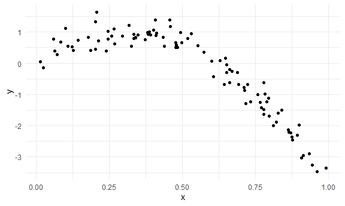
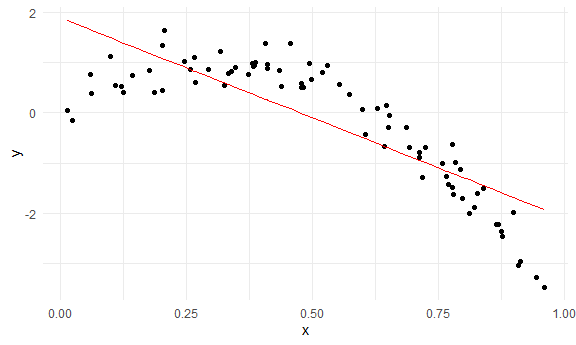
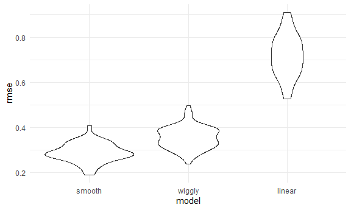
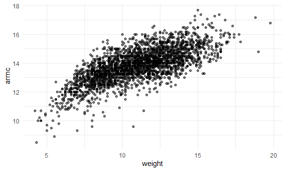
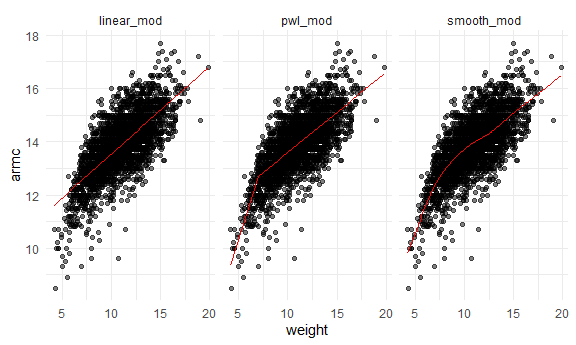
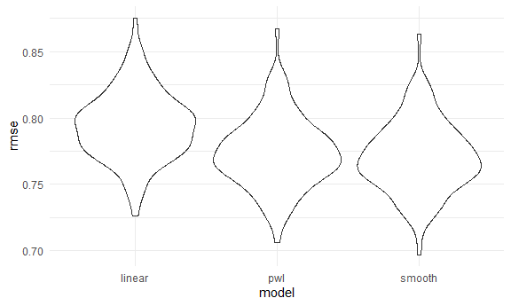

cross_validation
================
Jiayi Shi
2022-11-15

## Model selection

nested models: anova() non-nested models: AIC/BIC/etc balance bwt
goodness of fit and complexity

## CV by hand

build model on training dataset and evaluate using RMSE on test dataset

Generates data under a non-linear model

``` r
nonlin_df = 
  tibble(
    id = 1:100,
    x = runif(100, 0, 1),
    y = 1 - 10 * (x - .3) ^ 2 + rnorm(100, 0, .3)
  )

nonlin_df %>% 
  ggplot(aes(x = x, y = y)) + 
  geom_point()
```



Split into training and test sets using:

df %\>% `sample_n(numebr_in_train)`/`slice_sample(n = number_in_train)`:
select number_in_train observations from the original dataset `df`
randomly.

and

`anti_join(x,y)`: return all rows from x without a match in y.

``` r
train_df = nonlin_df %>% slice_sample(prop = 0.8)
test_df = anti_join(nonlin_df, train_df)
```

    ## Joining, by = c("id", "x", "y")

``` r
# test_df = anti_join(nonlin_df, train_df, by = "id")

ggplot(train_df, aes(x = x, y = y)) + 
  geom_point() + 
  geom_point(data = test_df, color = "red")
```


`mgcv::gam()`: Generalized additive models \* additive models
e.g. polynomial models

Build three models with different compolexity (non-nested)

``` r
linear_mod = lm(y ~ x, data = train_df)
smooth_mod = mgcv::gam(y ~ s(x), data = train_df)
wiggly_mod = mgcv::gam(y ~ s(x, k = 30), sp = 10e-6, data = train_df)
```

`add_predictions(data, model)`: Add predictions to a data frame
`add_residuals(data, model)`: Add residuals to a data frame

``` r
train_df %>% 
  add_predictions(linear_mod) %>% # add a column "pred"
  ggplot(aes(x = x, y = y)) + geom_point() + 
  geom_line(aes(y = pred), color = "red")
```



`modelr::gather_predictions`: add predictions for several models to a
data frame and then “pivoting” so the result is a tidy, “long” dataset
that’s easily plottable. (add two columns: “model” and “pred”)

``` r
train_df %>% 
  gather_predictions(linear_mod, smooth_mod, wiggly_mod) %>% 
  mutate(model = fct_inorder(model)) %>% 
  ggplot(aes(x = x, y = y)) + 
  geom_point() + 
  geom_line(aes(y = pred), color = "red") + 
  facet_wrap(~model)
```


`rmse(model, data)` data used to get the predictions and then calculate
rmse

``` r
rmse(linear_mod, test_df)
```

    ## [1] 0.7052956

``` r
rmse(smooth_mod, test_df)
```

    ## [1] 0.2221774

``` r
rmse(wiggly_mod, test_df)
```

    ## [1] 0.289051

## CV using `modelr::corssv_mc(dataset, #splits)`

``` r
cv_df = 
  crossv_mc(nonlin_df, 100) # 100: number of splits => train(list), test(list), id

cv_df %>% pull(train) %>% .[[1]] %>% as_tibble # get the training set from the first split (id,x,y)
```

    ## # A tibble: 79 × 3
    ##       id      x       y
    ##    <int>  <dbl>   <dbl>
    ##  1     1 0.266   1.11  
    ##  2     2 0.372   0.764 
    ##  3     3 0.573   0.358 
    ##  4     4 0.908  -3.04  
    ##  5     6 0.898  -1.99  
    ##  6     7 0.945  -3.27  
    ##  7     8 0.661  -0.615 
    ##  8     9 0.629   0.0878
    ##  9    10 0.0618  0.392 
    ## 10    11 0.206   1.63  
    ## # … with 69 more rows

``` r
cv_df = 
  cv_df %>% 
  mutate(
    train = map(train, as_tibble),
    test = map(test, as_tibble)) %>% # convert resample to tibble
  mutate(
    linear_mod  = map(.x = train, ~lm(y ~ x, data = .x)),
    smooth_mod  = map(.x = train, ~gam(y ~ s(x), data = .x)),
    wiggly_mod  = map(.x = train, ~gam(y ~ s(x, k = 30), sp = 10e-6, data = .x))) %>% 
  mutate(
    rmse_linear = map2_dbl(linear_mod, test, ~rmse(model = .x, data = .y)),
    rmse_smooth = map2_dbl(smooth_mod, test, ~rmse(model = .x, data = .y)),
    rmse_wiggly = map2_dbl(wiggly_mod, test, ~rmse(model = .x, data = .y)))
```

``` r
cv_df %>% 
  select(starts_with("rmse")) %>% 
  pivot_longer(
    everything(),
    names_to = "model", 
    values_to = "rmse",
    names_prefix = "rmse_") %>%
  mutate(model = fct_reorder(model, rmse)) %>% 
  #mutate(model = fct_inorder(model)) %>%
  ggplot(aes(x = model, y = rmse)) + geom_violin()
```



## Example: Child Growth

``` r
child_growth = read_csv("./data/nepalese_children.csv")
```

    ## Rows: 2705 Columns: 5
    ## ── Column specification ────────────────────────────────────────────────────────
    ## Delimiter: ","
    ## dbl (5): age, sex, weight, height, armc
    ## 
    ## ℹ Use `spec()` to retrieve the full column specification for this data.
    ## ℹ Specify the column types or set `show_col_types = FALSE` to quiet this message.

``` r
child_growth %>% 
  ggplot(aes(x = weight, y = armc)) + 
  geom_point(alpha = .5)
```



piecewise linear model: pwl_mod

``` r
child_growth =
  child_growth %>% 
  mutate(weight_cp = (weight > 7) * (weight - 7))
```

``` r
linear_mod = lm(armc ~ weight, data = child_growth)
pwl_mod    = lm(armc ~ weight + weight_cp, data = child_growth)
smooth_mod = gam(armc ~ s(weight), data = child_growth)
```

``` r
child_growth %>% 
  gather_predictions(linear_mod, pwl_mod, smooth_mod) %>% 
  #add_predictions(single_model)
  mutate(model = fct_inorder(model)) %>% 
  ggplot(aes(x = weight, y = armc)) + 
  geom_point(alpha = .5) +
  geom_line(aes(y = pred), color = "red") + 
  facet_grid(~model)
```



``` r
cv_df =
  crossv_mc(child_growth, 100) %>% 
  mutate(
    train = map(train, as_tibble),
    test = map(test, as_tibble)) %>% 
  mutate(
    linear_mod  = map(train, ~lm(armc ~ weight, data = .x)),
    pwl_mod     = map(train, ~lm(armc ~ weight + weight_cp, data = .x)),
    smooth_mod  = map(train, ~gam(armc ~ s(weight), data = as_tibble(.x)))) %>% 
  mutate(
    rmse_linear = map2_dbl(linear_mod, test, ~rmse(model = .x, data = .y)),
    rmse_pwl    = map2_dbl(pwl_mod, test, ~rmse(model = .x, data = .y)),
    rmse_smooth = map2_dbl(smooth_mod, test, ~rmse(model = .x, data = .y)))

cv_df %>% 
  select(starts_with("rmse")) %>% 
  pivot_longer(
    everything(),
    names_to = "model", 
    values_to = "rmse",
    names_prefix = "rmse_") %>% 
  mutate(model = fct_inorder(model)) %>% 
  ggplot(aes(x = model, y = rmse)) + geom_violin()
```


